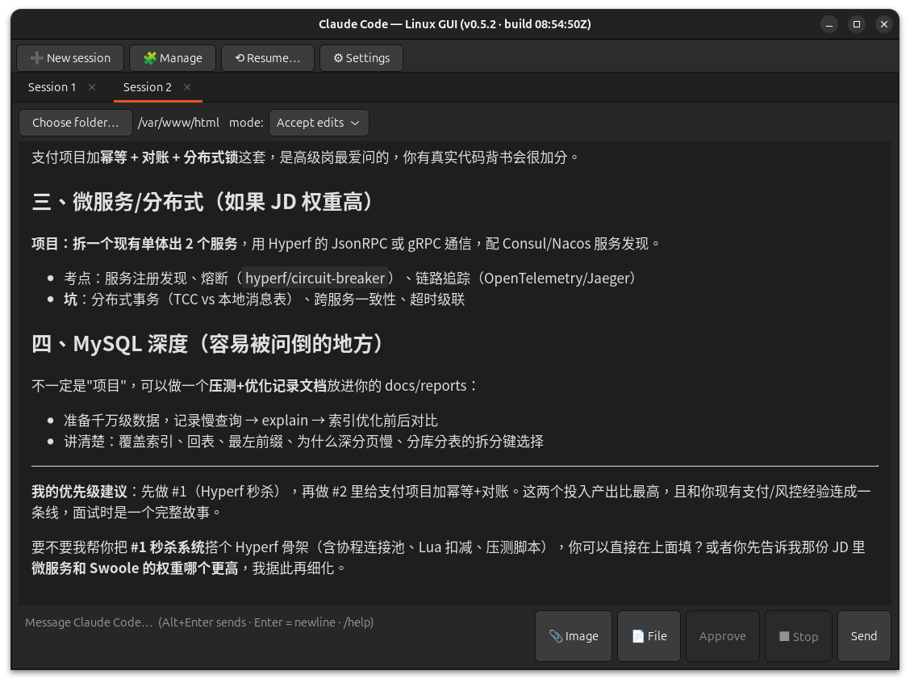

# Claude Code — Linux GUI (v0.5.3)

A minimal, **native** (GTK4, no Electron) free/open-source desktop GUI for the
official **Claude Code** CLI on Linux.



> Not affiliated with, endorsed by, or sponsored by Anthropic. Independent
> wrapper around the official `claude` command-line tool.

## Status

- Compiles and runs (GTK4 + WebKitGTK 6). Built and used on Ubuntu 24.04.
- It is a **thin transport**: one persistent `claude -p` process per session
  tab over the stream-json protocol. The GUI does not reimplement the
  interactive client — see `DESIGN.md` for what that does and does not allow.
- GUI behaviour is exercised by hand, not by an automated test suite.

## Features

- **Multiple sessions** — tabs (`➕ New session`); each is an independent
  conversation (own folder, history, approved dirs). Close one with the
  **✕** on its tab or the `/exit` command (kills that session's `claude`
  process). Switching tabs — or returning to the window from another app —
  puts the cursor straight in the current session's input.
- **Streaming output** with Markdown rendering; live tool / thinking status.
  The full answer is preserved even when a turn writes text, calls a tool,
  then writes more (the part before the tool call no longer vanishes).
- **Copy & zoom the transcript** — drag to select (the highlight stays
  visible even though the read-only view never holds keyboard focus);
  **Ctrl+C** copies the selection, **Ctrl+A** selects all (when the input
  box is empty). **Ctrl+=** / **Ctrl+-** resize the transcript font and
  **Ctrl+0** resets; the size is remembered across restarts.
- **Multi-line input**: **Alt+Enter sends**; plain **Enter inserts a
  newline** and (importantly) commits a CJK/IME composition without sending.
  The **Send** button always sends.
- **Per-session permission mode** dropdown (`Ask` / `Plan` / `Accept edits`
  / `Auto`) and an **Approve** flow for denied actions (restarts with
  `--resume` so context carries).
- **■ Stop** — interrupt the current turn (restarts with `--resume`,
  context kept).
- **Built-in commands** (a leading `/`; unknown `/x` is sent verbatim),
  with `/`-prefix autocomplete from the registry:
  `/model`, `/permission-mode`, `/effort`, `/worktree`, `/fork-session`,
  `/clear`, `/status`, `/help`, `/exit`. See `DESIGN.md`.
- **📎 Image** — paste a clipboard image; it is *attached* (saved under a
  per-process `/tmp` dir, never in your project) so you can keep typing, and
  rides with your next message.
- **📄 File** — insert a file path (workdir-relative when inside) into the
  message.
- **⟲ Resume…** — browse and resume a prior session from
  `~/.claude/projects`.
- **⚙ Settings** — raw JSON editor for `~/.claude/settings.json`
  (validates on save, backs up to `settings.json.bak`).
- **🧩 Manage** — browse installed/available plugins, marketplaces, MCP
  servers (read from `~/.claude.json`, secrets hidden), skills; confirmed
  plugin/marketplace/mcp actions. Read-only and mutating paths per `DESIGN.md`.
- The window title shows a **build timestamp** (`build HH:MM:SSZ`) so it is
  obvious whether a fresh build is running.

## Prerequisites

- A Rust toolchain — install via [rustup](https://rustup.rs).
- GTK4 + WebKitGTK 6 development libraries. On Debian/Ubuntu:
  `sudo apt install libgtk-4-dev libwebkitgtk-6.0-dev build-essential`
- The official Claude Code CLI installed and authenticated (`claude`).

## Install (recommended — no more `cargo run`)

```bash
./install.sh
```

Builds the release binary, installs it to `~/.local/bin/claude-code-linux-gui`,
and installs the icon + `.desktop`. Then launch from the app menu or run
`claude-code-linux-gui`. Re-run `./install.sh` to upgrade after code changes;
`./install.sh --no-build` reuses an existing `target/release` binary.

### Ubuntu 23.10+ : AppArmor / WebKit sandbox

Ubuntu restricts unprivileged user namespaces, so WebKitGTK's mandatory
`bwrap` sandbox aborts on launch (`bwrap: setting up uid map: Permission
denied`). Install the bundled AppArmor profile once (it only re-grants
`userns` to this binary; system-wide hardening is untouched):

```bash
sudo ./install-apparmor.sh
```

### Build a .deb (distributable / other machines)

```bash
pkg/build-deb.sh            # -> dist/claude-code-linux-gui_<ver>_<arch>.deb
sudo apt install ./dist/claude-code-linux-gui_*.deb
```

Builds the release binary first (`pkg/build-deb.sh --no-build` reuses an
existing `target/release` binary) and packages with `dpkg-deb`. Needs
`dpkg-deb` + `dpkg-architecture` (Debian/Ubuntu base; `dpkg-dev`). Version
is read from `Cargo.toml`, architecture from `dpkg-architecture`.

Installs the binary to `/usr/bin`, the icon/`.desktop`, and the AppArmor
profile to `/etc/apparmor.d`. The package's `postinst` loads the AppArmor
profile automatically, so the separate `install-apparmor.sh` step is
**not** needed when installing via the `.deb`. Declared runtime deps:
`libc6`, `libgtk-4-1`, `libwebkitgtk-6.0-4`. Remove with
`sudo apt remove claude-code-linux-gui` (the `prerm` unloads the profile).

### Note: single-instance app

It is a single-instance GApplication: relaunching while an old copy is alive
just re-activates the old process, so you would see stale code. Two
safeguards: `./install.sh` stops any running instance before installing, and
the window title shows a `build HH:MM:SSZ` stamp — glance at it to confirm
the fresh build is running.

## Development build

```bash
cargo run
```

Single-instance still applies: stop any installed/running copy first. Match
by executable, not `pkill -f` (its pattern would also match your shell's
path):

```bash
for p in $(pgrep -f claude-code-linux-gui); do
  case "$(readlink -f /proc/$p/exe)" in */claude-code-linux-gui) kill "$p";; esac
done
```

## Donate

If this is useful to you, tips are welcome in **USDT or USDC on the
Polygon (PoS) network**:

```
0x5072b3d05f1550f30bd22b0175ca55bb27294bca
```


[View on Polygonscan](https://polygonscan.com/address/0x5072b3d05f1550f30bd22b0175ca55bb27294bca)

> ⚠️ **Polygon network only.** Send only USDT or USDC on Polygon PoS to
> this address. Sending other tokens, or the same tokens on a different
> chain (Ethereum, BSC, etc.), will be **permanently lost** — crypto
> transfers are irreversible. Double-check the address and network before
> sending.

## License

**MIT** — see [`LICENSE`](LICENSE). Use it, modify it, redistribute it,
commercial or not; just keep the copyright notice. No warranty.
